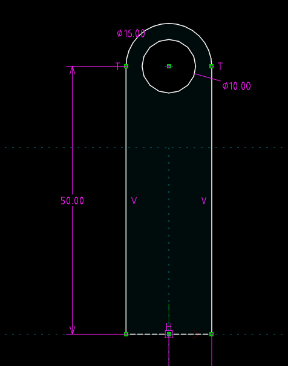
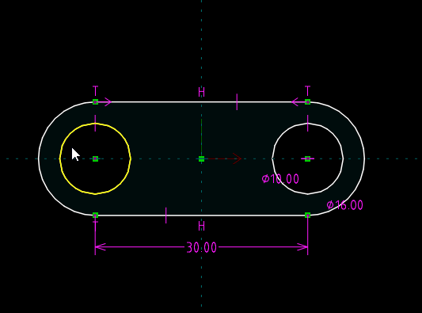
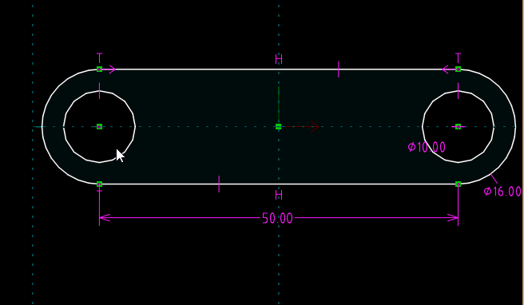
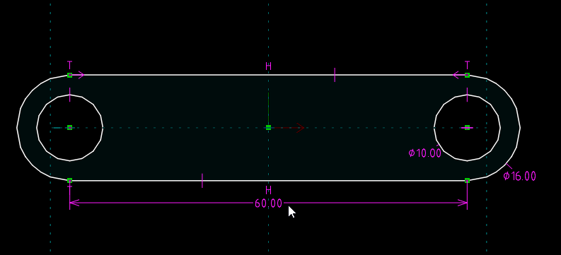
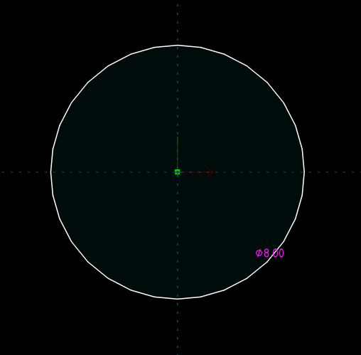
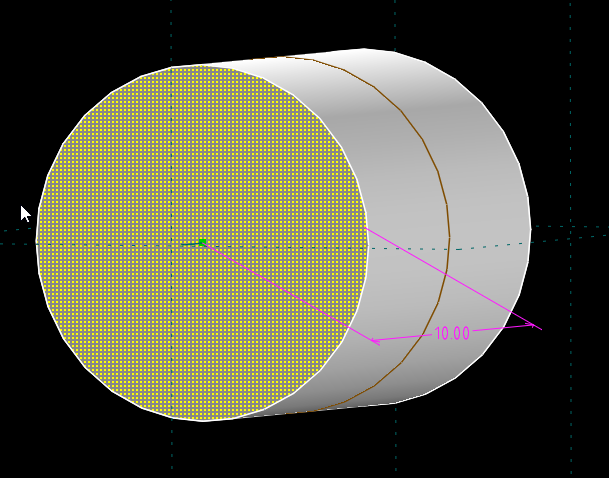
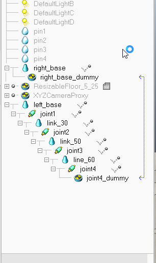
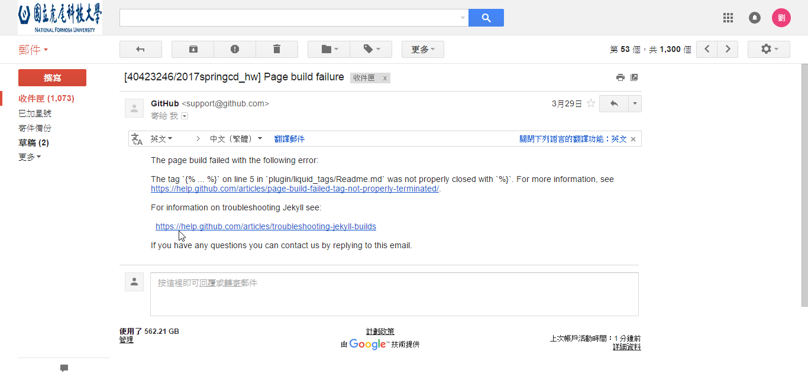
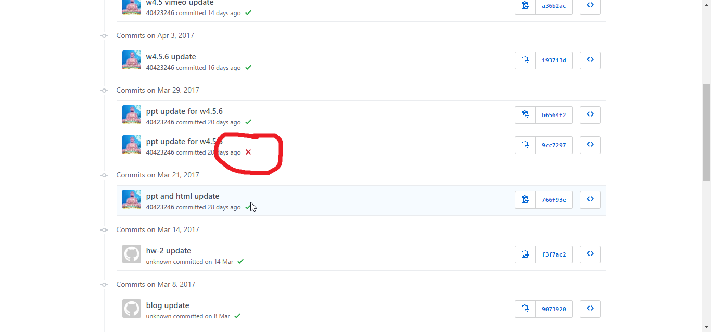
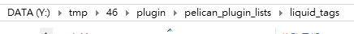

Title: 2017/03/29 W6
Date: 2017-03-29 13:00
Category: Course
Tags: 111
Slug: 2017Spring-cd-W6
Author: 40423246

##2017Spring 協同產品設計實習課程  第六週上課內容

###Fourbar運動模擬

###1.各零件尺寸

###二.在 V-rep 模擬 Fourbar

###三.解決倉儲推送出現問題

<!-- PELICAN_END_SUMMARY -->

##Fourbar運動模擬
##1.各零件尺寸
1.link01

2.link30

3.link50

4.link60

4.link8*10

##二.在 V-rep 模擬 Fourbar

<button onClick="lity('https://vimeo.com/211155142')">V-rep</button>

##三.解決倉儲推送出現問題

解決辦法：
刪掉裡面所有的東西

原因：是Github更新造成版本錯誤，只要刪掉衝突的東西就能正常上傳。

##四.心得：
這次發現無法推到Github，有點嚇到，以為我把它弄爆了，去查了一下知道怎麼解決，感覺還不錯，下次如過有問題，希望也能這樣順利解決。

