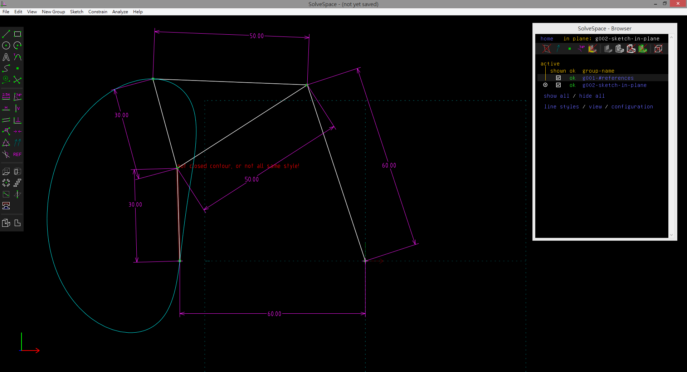

Title: 2017/04/26 W10
Date: 2017-04-26 13:00
Category: Course
Tags: 11
Slug: 2017Spring-cd-W10
Author: 40423246
 

##四連桿機構協同 Trace Point 查驗
<!-- PELICAN_END_SUMMARY -->
尺寸圖

##Onshape 運動模擬
<iframe src="https://player.vimeo.com/video/214771995" width="640" height="317" frameborder="0" webkitallowfullscreen mozallowfullscreen allowfullscreen></iframe>

<a href="https://vimeo.com/214771995">期中行走機構</a> from <a href="https://vimeo.com/user60140629">40423246</a> on <a href="https://vimeo.com">Vimeo</a>.

V-rep 運動模擬
<iframe src="https://player.vimeo.com/video/222355177" width="640" height="457" frameborder="0" webkitallowfullscreen mozallowfullscreen allowfullscreen></iframe>

<a href="https://vimeo.com/222355177">Fourbar  V-rep模擬</a> from <a href="https://vimeo.com/user60140629">40423246</a> on <a href="https://vimeo.com">Vimeo</a>.

